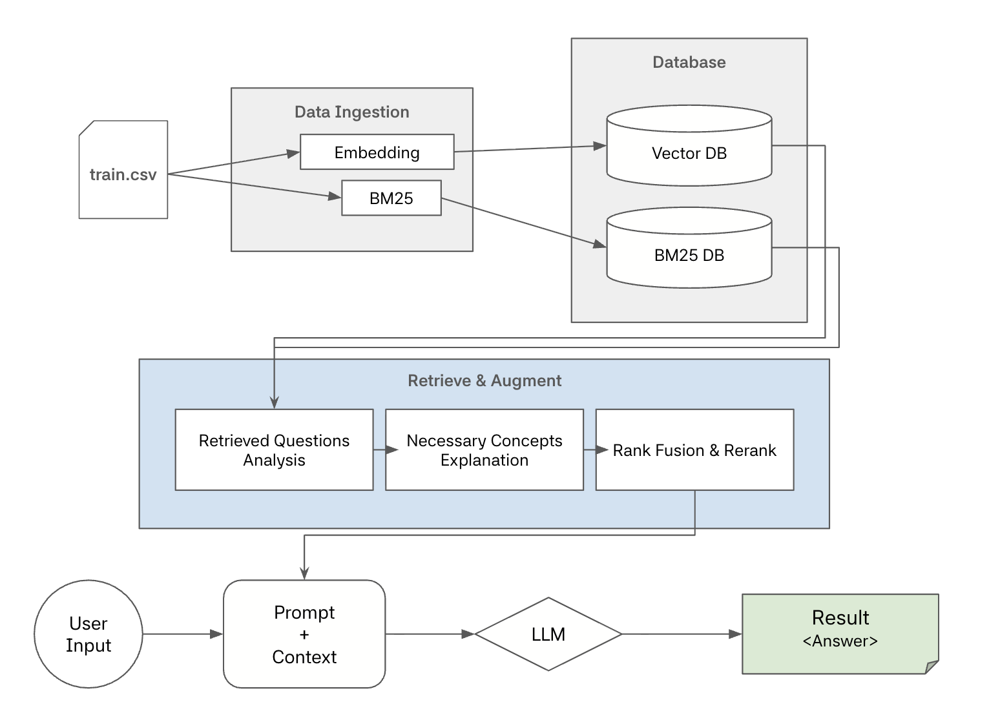

# RAG Agent System for Solving Math Problems

## Description

**Objective**: The core motivation for this project is to implement an RAG Agent System that helps LLM Models answer math question written in latex format.

**Key Achievement**: Improved GPT-o4-mini's performance by \_%.

**Tech Stack**:

- **File Structure**:

```plain text
RAG_Math
 ┣ data
 ┃ ┣ test_with_answer.csv
 ┃ ┗ train.csv
 ┣ search_db
 ┃ ┣ vector_db
 ┃ ┗ bm25_index.pkl
 ┣ scripts
 ┃ ┣ append_answer.py
 ┃ ┗ run_ingestion.py
 ┣ src
 ┃ ┣ utils
 ┃ ┃ ┣ __pycache__
 ┃ ┃ ┃ ┗ bm25_utils.cpython-312.pyc
 ┃ ┃ ┣ bm25_utils.py
 ┃ ┃ ┗ solve_question.py
 ┃ ┣ agent.py
 ┃ ┣ collection.py
 ┃ ┗ prompts.py
 ┣ .env
 ┣ pyproject.toml
 ┣ Dockerfile
 ┣ Makefile
 ┣ uv.lock
 ┣ README.md
 ┗ main.py
```

## Quick Start

Enter your Open AI API key first, then call `make launch`. It might take a while for this program to start.

```bash
echo "OPENAI_API_KEY=your_api_key" > .env

make launch
```

Try the `/inference` endpoint by putting in the `test_with_answer.csv` file. You can try with any csv file, but it must have the same columns as the `test_with_answer.csv`.

## Agent System Architecture



## Key features

### 1. RRF (Reciprocal Rank Fusion) Reranking

- Reduces bias from any single retrieval method, ensuring the LLM receives the 5 most trustworthy reference problems to refer to.

### 2. Hybrid Retrieval (Vector + Keyword Search)

- **Vector Search**: Retreives questions in the same category based on similarity of the entire question.

- **Keyword Search (BM25)**: Retrieves questions based on similarity of the keywords used in the question.

### 3. Context Enrichment

- **Context Explanation**: Instead of simply retrieving and augmenting the context, it generates simple summary of the key concepts used in the retrieved context.

### 4. Performance Optimization

- **Asynchronous Processing**: Turned each steps to be asynchronous so that it can generate inference in parrallel, significantly reducing time.

- **Rate Limit Management**: Used `asyncio.Semaphore` to prevent OpenAI API to reach its TPM.

## Performance Evaluation

### Description

We tested the model with 500 different questions from 7 different categories and 5 different levels (difficulties).

|     Model     | Overall Accuracy |
| :-----------: | :--------------: |
| **Baseline**  |                  |
| **RAG Agent** |                  |

By implementing RAG AI System, we improved the model's performance by \_%.

Even though our LLM model (gpt-o4-mini) is known to be bad at answering math questions, the overall accuracy of our RAG AI System is still lower than expected.\

There were some questions that the model answered correctly but was marked wrong because some of the syntax of answers (both from the system and test_with_answer.csv) were broken.

### Performance by Question Type

### Performance by Question Level (Difficulty)

## Future Improvement

- **Format Output**: The answer generate by the model is not uniform. Sometimes, integers come with an extra decimal (ex. 80.0 instead of 80).
